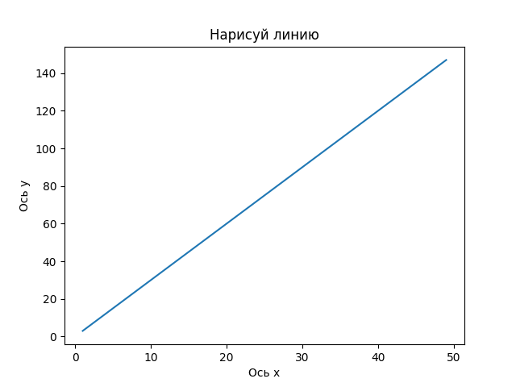
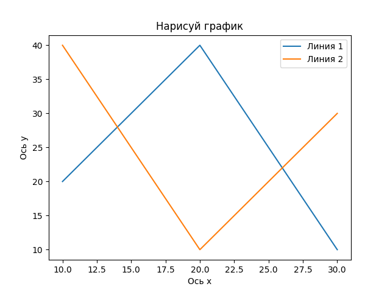
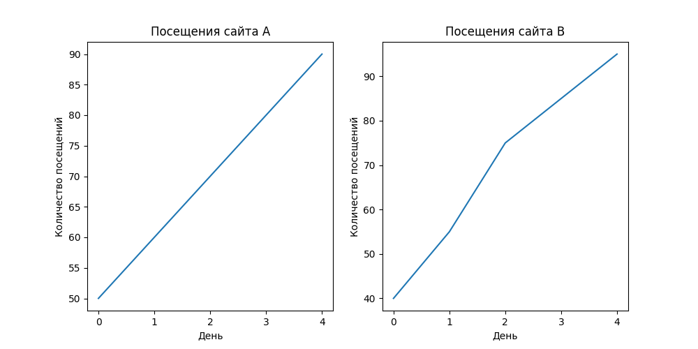
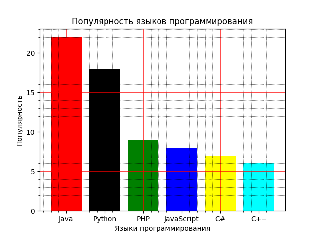
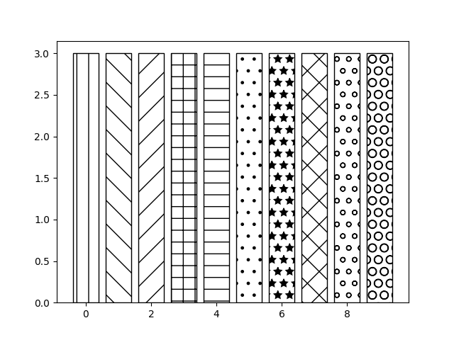
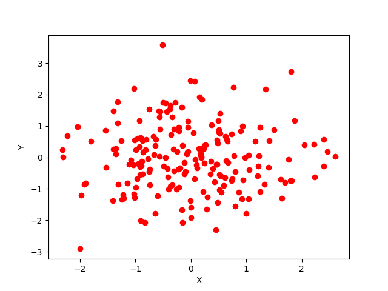

# Библиотека Matplotlib

## Задача 1

Вы молодой исследователь, недавно переехавший в маленький городок, где погода очень переменчива. Вы решили изучить ежедневные температуры в городе за неделю, чтобы лучше понять местный климат. Ваша задача — визуализировать эти данные в виде графика, чтобы наглядно представить перепады температур.

### Заданные данные о температурах

Понедельник: 25 градусов

Вторник: 28 градусов

Среда: 30 градусов

Четверг: 27 градусов

Пятница: 22 градусов

Суббота: 24 градусов

Воскресенье: 26 градусов

## Задача 2

Вы студент и проводите опрос среди своих одногруппников о их предпочтениях в отношении музыкальных жанров. Вам нужно визуализировать результаты опроса в виде круговой диаграммы.

### Результаты опроса

Рок: 30

Поп: 20

Хип-Хоп: 15

Электронная: 10

Классическая: 25

## Задача 3

Вы являетесь страстным любителем футбола и хотите проанализировать результаты матчей вашей любимой команды за последний сезон. Вам нужно визуализировать результаты игр в виде столбчатой диаграммы.

### Результаты матчей

Матч 1: 2 забито, 1 пропущен

Матч 2: 3 забито, 2 пропущено

Матч 3: 1 забит, 0 пропущено

Матч 4: 4 забито, 3 пропущено

Матч 5: 2 забито, 1 пропущен

## Задача 4

Вы работаете в компании, которая занимается продажей фруктов. Вам нужно визуализировать данные о продажах различных фруктов за последний месяц в виде горизонтальной столбчатой диаграммы.

### Данные о продажах фруктов

Яблоки: 100

Груши: 85

Бананы: 70

Апельсины: 60

Персики: 45

## Задача 5

Напишите программу чтобы нарисовать график аналогичный представленному ниже.

## Задача 6

Напишите программу чтобы нарисовать график аналогичный представленному ниже.

## Задача 7

У вас есть данные о количестве ежедневных посещений двух сайтов (сайт A и сайт B) за 5 дней. Ваша задача — визуализировать эти данные в виде двух графиков, аналогичным представленным ниже.

### Данные о посещениях сайтов

Сайт A: 50, 60, 70, 80, 90

Сайт B: 40, 55, 75, 85, 95

## Задача 8

Вы являетесь страстным любитилем программирования и хотите начать новый язык программирования, чтобы зарабатывать много денег. Все знают, что чем популярней язык — тем больше платят за его знание. Вам нужно визуализировать данные о популярности языков программировани в виде столбчатой диаграммы, аналогичной представленной ниже.

## Задача 9

Напишите программу чтобы нарисовать график аналогичный представленному ниже.

## Задача 10

Напишите программу чтобы нарисовать точечный график, берущий случайное распределение по X и Y и сопоставляющий их друг с другом.

> Для случайного распределения можно использовать метод `gauss()` из модуля `random`
