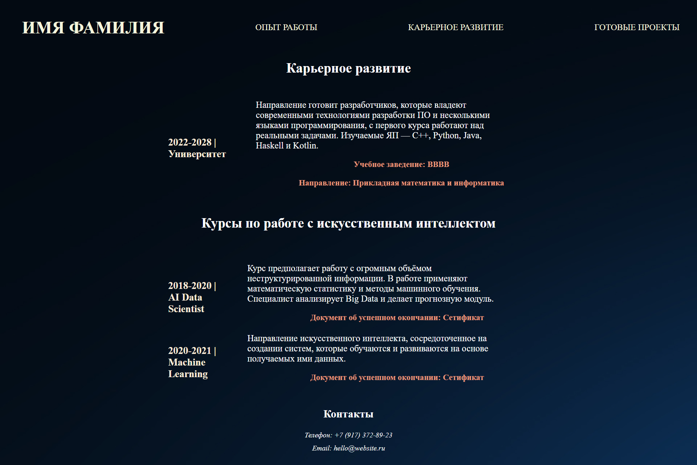

# HTML

Для продвижения личного бренда люди используют социальные сети или отраслевые пространства, например GitHub или Behance. При этом персональный сайт все еще актуален, не утратил своих преимуществ.
С помощью сайта можно выстраивать личный бренд, демонстрировать экспертность.

## Задача 1

Выполните все пункты задания и сравните с результатом. 

1. Создайте новый HTML-документ index.html. Пропишите минимально необходимый набор тегов, который служит каркасом любого HTML-документа;

```html
<!DOCTYPE html>
<meta charset="utf-8">
<html lang="ru">
<title>mypage</title>
  <head>
    <!-- Служебная информация -->
  </head>
  <body>
    <!-- Содержание -->
  </body>
</html>
```

2. В теге body создайте абзац, в котором содержатся три ссылки. Первая ссылка с текстом "Портфолио", вторая ссылка с текстом "Проекты", третья ссылка с текстом "Контакты";
3. После абзаца с ссылками добавьте заголовок первого уровня с текстом специальности, например "Специалист программной инженерии". Добавьте необходимый атрибут к элементу, чтобы осуществить выравнивание заголовка по центру;
4. Используйте HTML-элемент table для представления табличных данных. В первом столбце таблицы разместите фотографию. Во втором столбце в первой строке укажите ФИО, во второй - краткое описание результатов порфессиональной деятельности;

Ниже будут приведены примеры того, как это может выглядеть. Необязательно следовать такому дизайну с фоном/красивым текстом. Достаточно просто научится пользоваться HTML-тегами.
Ради понимания советуем изучить возможное решение на наличие дополнительных полей тегов, которые Вы можете внедрить в свое решение.

Возможная реализация: 


   
5. Создайте блок с описанем опыта работы. Добавьте заголовок первого уровня "Опыт работы";
6. Используйте HTML-элемент table для представления табличных данных. В первом столбце таблицы разместите наименования предприятий. Во втором столбце укажите занимаемую должность и ненумерованный список обязанностей;
 
Возможная реализация: 


7. Создайте блок с описанем вашего обучения и пройденных курсов подготовки. Добавьте заголовок первого уровня "Карьерное развитие";
8. Используйте HTML-элемент table для представления табличных данных. В первом столбце таблицы укажите наименования учебных заведений, во втором столбце - описание курса. Также необходимо прикрепить ссылку на документ, который подтверждает, что Вы успешно прошли выбранный курс; 

Возможная реализация: 


   
10. Создайте блок с описанем лучших проектов. Добавьте заголовок первого уровня "Готовые проекты";
11. Используйте HTML-элемент table для представления табличных данных; В первом столбце таблицы разместите фотографию итога деятельности, во втором информативное описание проекта. 

Возможная реализация: 


12. Добавьте блок в нижней части страницы. Укажите номер телефона и электронный адрес;
13. У ссылки с номером телефона используйте соответствующий протокол звонка при клике на эту ссылку. У ссылки с e-mail адресом используйте соответствующий протокол написания e-mail письма при клике на эту ссылку;

Возможная реализация: 


